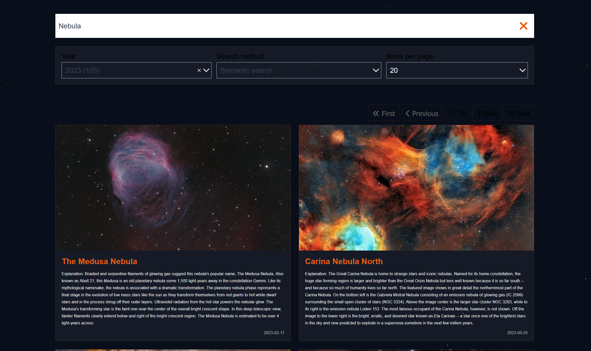
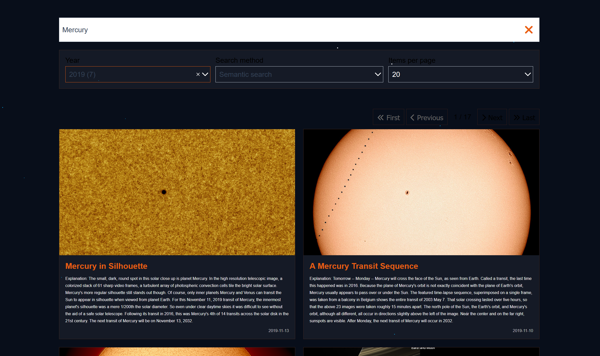
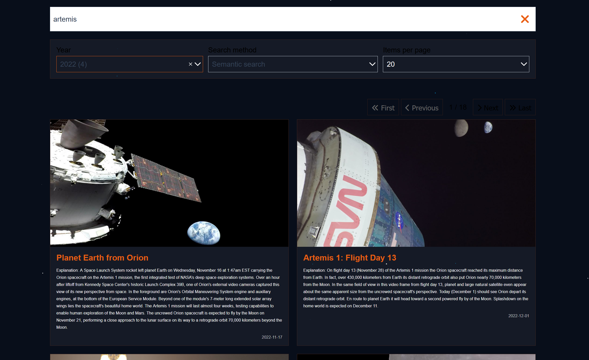
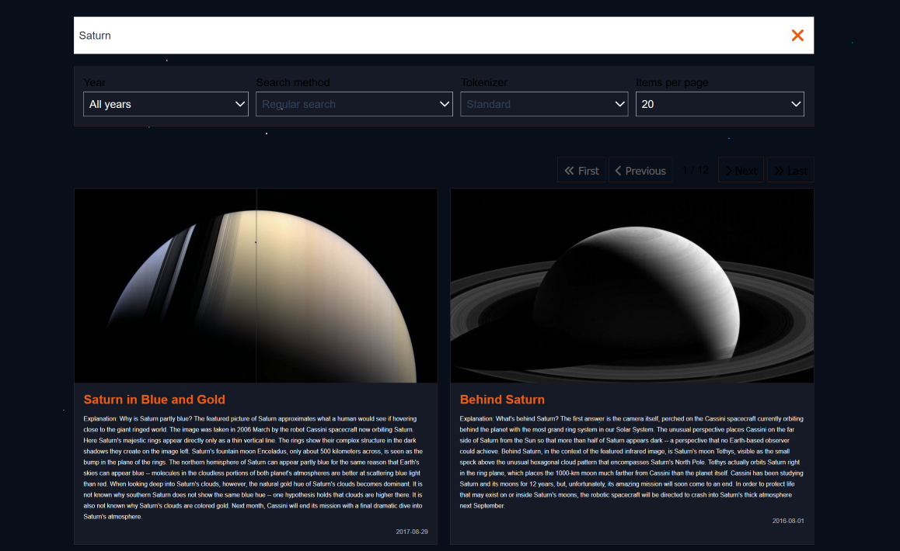
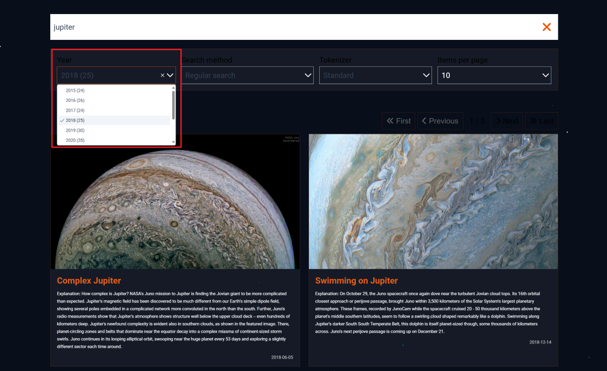
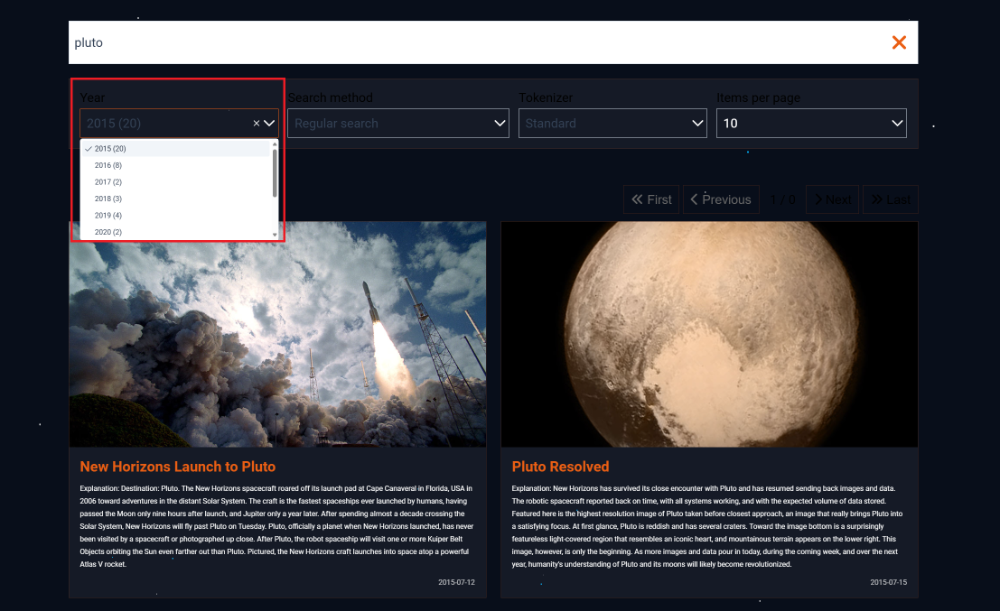
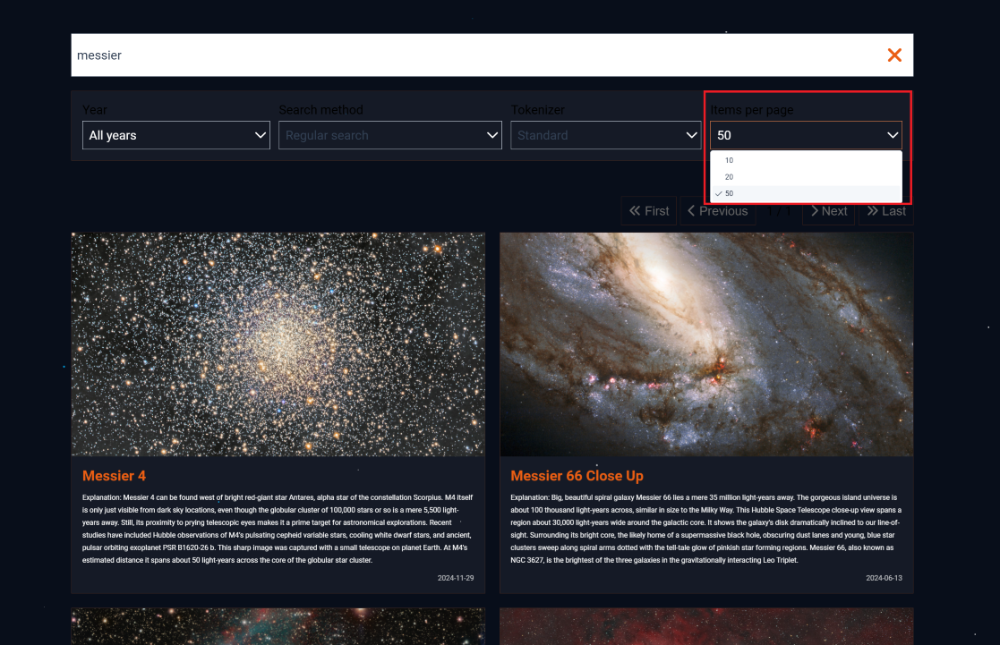
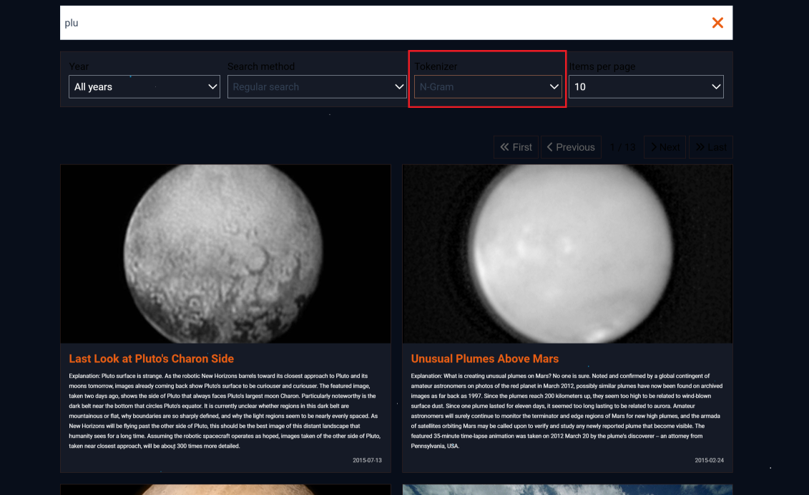
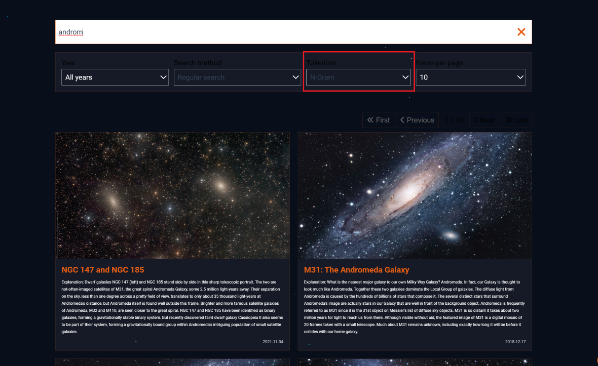
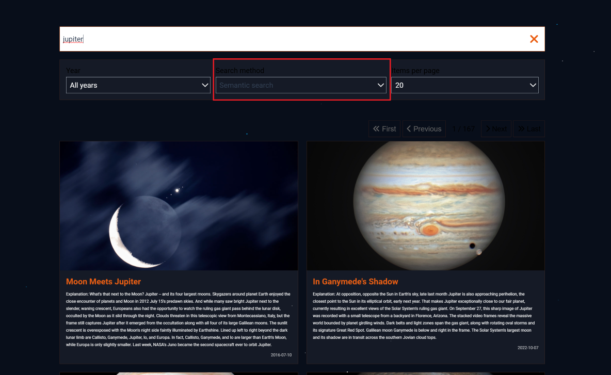

# Deployment Guide

## What is Elasticsearch?

**Elasticsearch** is a fast, distributed search and analytics engine for JSON data.  
In this project, it powers full-text search: documents are **indexed** via the backend, and search queries retrieve relevant results for the frontend.

---

## Quick Start

### Prerequisites

- **Elasticsearch** running on `localhost:9200`
- **Python 3.8+**
- **npm** (for frontend dependencies; Vue.js is installed via `npm install`)

---

### Creating a Virtual Environment

From your backend directory, run:
```bash
python -m venv venv
# On Windows:
venv\Scripts\activate
# On macOS/Linux:
source venv/bin/activate
```

---

### Installing Requirements

#### Backend (Python)

From your backend directory, run:
```bash
pip install -r requirements.txt
```

#### Frontend (Vue.js)

From your `frontend` directory, run:
```bash
npm install
```
This will install Vue.js and all other frontend dependencies listed in `package.json`.

---


### Backend Setup

#### Indexing Data

- **Default/N-Gram Indexing:**
  ```bash
  python index_data.py
  ```
- **Semantic Indexing (Hugging Face Embedding Model):**
  ```bash
  python index_data_embedding.py
  ```
- **Raw Data Indexing (removes HTML tags from JSON):**
  ```bash
  python index_data_raw.py
  ```

> **Note:**  
> Change variable names for indices (`INDEX_NAME_*` from `config.py`) in `main.py` as necessary to match your search type.

#### Start the FastAPI backend

```bash
fastapi dev main.py
```

---

### Frontend Setup

```bash
cd frontend
npm run serve
```

---

### Access the App

- [http://localhost:8080](http://localhost:8080)

---

## Overview

_Sample screenshots:_

<p align="center">
  
  
  
  
</p>

---

## Features

### Filter by Year

You can filter search results by year using the year dropdown in the UI.


<p align="center">
  
  
</p>

---

### Items Per Page

You can control how many results are shown per page using the "items per page" selector in the pagination bar.

<p align="center">
  
</p>

---

### Search As You Type

The search engine supports instant results and returns prefix matches as you type your query using N-Gram indexing.


<p align="center">
  
  
</p>

---

### Semantic Search

Semantic search is powered by a Hugging Face embedding model (all-MiniLM-L6-v2) for more relevant results.


<p align="center">
  
</p>


---

## Improvements

**Frontend**
- Theme Toggle:	Light/dark mode button
- Search Suggestions:	Autocomplete suggestions as the user types
- Image Favorites / Save List:	Allow users to "star" or save images
- Download Button:	One-click to download images
- Infinite Scroll:	Instead of pagination, load more results as user scrolls

**Backend**
- Integrate ELK (Elasticsearch + Logstash + Kibana) stack:
  - Logstash: Process and route logs or external data into Elasticsearch
  - Kibana: Visualize search engine analytics, user interaction logs, and API monitoring


---

## Troubleshooting

- **Elasticsearch errors:** Ensure it’s running in Docker and accessible at `localhost:9200`.
- **Missing data file:** Check that your dataset (e.g., `apod.json`) exists in the expected location.
- **Dependency issues:** Make sure Python and npm dependencies are installed.

---

## Useful Links

- [Elasticsearch Docs](https://www.elastic.co/guide/en/elasticsearch/reference/current/index.html)
- [3CodeCamp's Elasticsearch Course](https://www.youtube.com/playlist?list=PLMSb3cZXtIfpiHVLwXhaWk3KDXuklHdj5)
- [FastAPI Docs](https://fastapi.tiangolo.com/)
- [Vue.js Docs](https://vuejs.org/)
- [NASA's APOD Archive](https://apod.nasa.gov/apod/archivepixFull.html)
